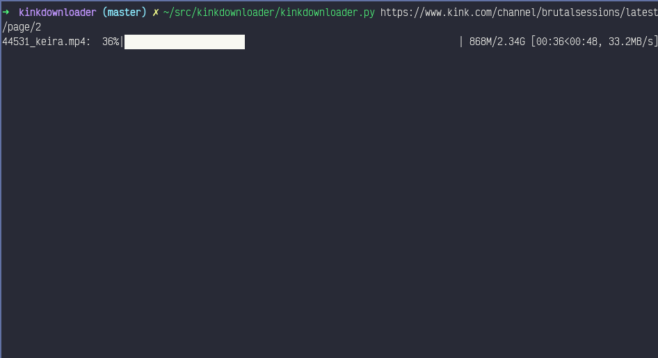
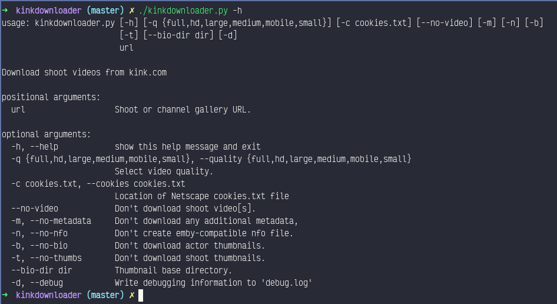

# Introduction #

For the past half decade or so, I have been downloading videos from kink.com and storing them locally on my own media server so that the SO and I can watch them on the TV. Originally, I was doing this manually, and then I started using a series of shell scripts to download them via curl. After maintaining that solution for a couple years, I decided to do a full rewrite in a more suitable language. "Kinkdownloader" is the fruit of that labor.

# Features #

* Allows archiving of individual shoots or full channel galleries.
* Downloads highest quality shoot videos with user-selected cutoff.
* Creates Emby/Kodi compatible NFO files containing: 
  * Shoot title 
  * Shoot date
  * Scene description 
  * Genre tags 
  * Performer information
* Downloads performer bio images.
* Downloads shoot thumbnails.
* Downloads shoot "poster" image.

# Screenshot #

# Requirements #

* [Python 3.7+](https://www.python.org/)
* [BeautifulSoup4](https://www.crummy.com/software/BeautifulSoup/)
* [cloudscraper](https://github.com/VeNoMouS/cloudscraper)
* [tqdm](https://tqdm.github.io/)

Kinkdownloader also requires a Netscape "cookies.txt" file containing your kink.com session cookie. You can create one manually, or use a browser extension like ["cookies.txt"](https://addons.mozilla.org/en-US/firefox/addon/cookies-txt/). Its default location is ~/cookies.txt [or Windows/MacOS equivalent]. This can be changed with the --cookies flag.

# Usage #

# FAQ #

## Examples? ##

Want to download just the video for a single shoot?

    kinkdownloader --no-metadata https://www.kink.com/shoot/XXXXXX

Want to download only the metadata?

    kinkdownloader --no-video https://www.kink.com/shoot/XXXXXX

How about downloading the latest videos from your favorite channel?

    kinkdownloader https://www.kink.com/channel/CHANNELXXX/latest/page/1

Want to archive a full channel [using POSIX shell and curl to get total number of gallery pages].

    max=$(curl -s https://www.kink.com/channel/CHANNELX/latest/page/1 | grep latest | awk '{print $4}' | sort -rn | head -n 1 | tr -d '[:space:]'); for i in $(seq 1 $max); do kinkdownloader https://www.kink.com/channel/CHANNELX/latest/page/${i}; done

## Where do I get it? ##

There is a git repository located [here](https://gitlab.com/meanmrmustardgas/kinkdownloader).

## How can I report bugs/request features? ##

You can either PM me on [reddit](https://www.reddit.com/u/mean_mr_mustard_gas), post on the [issues board](https://gitlab.com/meanmrmustardgas/kinkdownloader/-/issues) on gitlab, or send an email to meanmrmustardgas at protonmail dot com.

## This is awesome. Can I buy you beer/hookers? ##

Sure. If you want to make donations, you can do so via the following crypto addresses:

# TODO #

* Rate limiting to avoid temporary bans.
